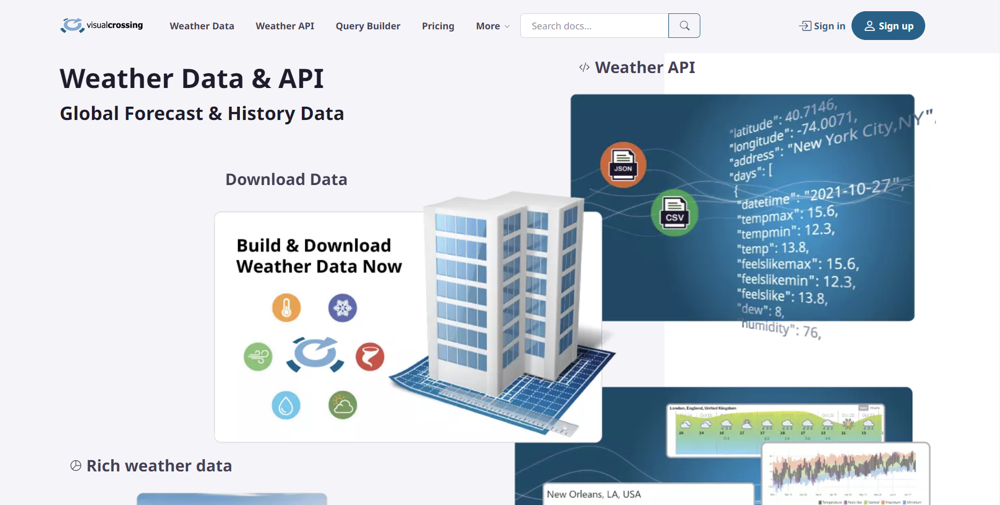

# How to use the weather API from Visual Crossing
https://www.visualcrossing.com/



I wanted to add weather to my own dataset and this is how I did it

First I contacted visual crossing and got an API from them 

```python
API_KEY = "VQZEZ"
```

Then I took a part of the large dataset

```python
one_row = crimes[6400000:6500000]
one_row = one_row.reset_index()
```

I then created a dictionary

```python
json_dict = {"Block": [], "Primary Type": [], "Domestic": [],
 "FBI Code": [], "Date_2": [], "Time": [], "Latitude": [], 
 "Longitude": [],"resolvedAddress": [],"date": [], "tempmax": [], 
 "tempmin": [], "temp": [], "feels_like_max": [], 
 "feels_like_min": [], "feels_like": [], "dew": [], "humidity": [], 
 "precip": [], "precipprob": [], "preciptype": [], 
 "snow": [], "snowdepth": [], "windspeed": [], "visibility": [], 
 "cloudcover": [], "conditions": [], "description": []}
```

This is to append the weather data to your current dataset

```python
for x in range(len(one_row)):
    date = one_row.Date_2[x]
    time = one_row.Time[x]
    Lati = one_row.Latitude[x]
    Long = one_row.Longitude[x]
    response = requests.get(f'https://weather.visualcrossing.com/VisualCrossingWebServices/rest/services/timeline/{Lati}%2C%20{Long}/{date}T{time}?key={API_KEY}&include=current').json()

    print(x)

    json_dict["Block"].append(one_row["Block"].iloc[x])
    json_dict["Primary Type"].append(one_row["Primary Type"].iloc[x])
    json_dict["Domestic"].append(one_row["Domestic"].iloc[x])
    json_dict["FBI Code"].append(one_row["FBI Code"].iloc[x])
    json_dict["Date_2"].append(one_row["Date_2"].iloc[x])
    json_dict["Time"].append(one_row["Time"].iloc[x])
    json_dict["Latitude"].append(one_row["Latitude"].iloc[x])
    json_dict["Longitude"].append(one_row["Longitude"].iloc[x])

    json_dict["resolvedAddress"].append(response['resolvedAddress'])
    json_dict["date"].append(response['days'][0]['datetime'])
    json_dict["tempmax"].append(response['days'][0]['tempmax'])
```

This is to convert it to a dataframe and then csv

```python
df = pd.DataFrame(json_dict)

df.to_csv('65_weather.csv')
```